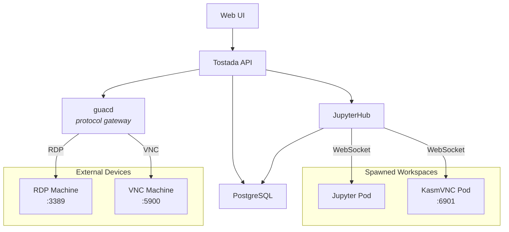

# Tostada

A multi-tenant workspace platform that spawns and manages remote desktops, notebooks, and web apps from a single pane of glass.

## Architecture

Tostada uses **JupyterHub** as its orchestration layer — handling authentication, spawning, and proxying — to serve diverse workspace types through a unified portal:

| Workspace Type | How It Connects |
|---|---|
| Jupyter Notebook | Native JupyterHub proxy |
| KasmVNC Desktop | JupyterHub proxies WebSocket directly (KasmVNC's own web client) |
| External RDP/VNC Devices | guacd translates RDP/VNC → WebSocket via guacamole-common-js |



### Key Design Decisions

- **JupyterHub is the control plane**, not Guacamole. Guacamole has no spawner — it only connects to existing machines. KubeSpawner fills that gap.
- **guacd is a protocol gateway only.** We use `guacamole-common-js` to embed the remote desktop client in our own UI — no default Guacamole webapp needed.
- **KasmVNC bypasses guacd entirely.** KasmVNC removed raw VNC (RFB) protocol support and speaks only WebSocket via its own web client.
- **PostgreSQL is shared.** A single PostgreSQL instance serves both tostada (devices, users) and JupyterHub (hub state) in separate databases.

### Components

| Component | Role |
|---|---|
| **Tostada API** | Go backend — devices, users, sessions, OIDC auth, audit logging |
| **JupyterHub** | Multi-tenant spawning (KubeSpawner) and reverse proxy |
| **PostgreSQL** | Shared database (tostada DB + jupyterhub DB) |
| **guacd** | Apache Guacamole protocol proxy (RDP/VNC → WebSocket) |
| **KasmVNC** | Containerized Linux desktops with a native web client |
| **Gateway (nginx)** | Reverse proxy for routing UI, API, and Hub traffic |

## Installation

### Helm Chart (OCI)

```sh
helm install tostada oci://ghcr.io/rophy/charts/tostada --version <version>
```

### Prerequisites

A Kubernetes secret with application credentials must exist before installing:

| Key | Purpose | How to generate |
|-----|---------|-----------------|
| `oidc-client-secret` | OIDC client secret from your identity provider | From your IdP's client registration |
| `guacamole-json-secret-key` | Symmetric key for Guacamole JSON auth tokens | `openssl rand -hex 32` |
| `hub.services.tostada.apiToken` | API token for tostada → JupyterHub API | `openssl rand -hex 32` |

```sh
kubectl create secret generic tostada-secrets \
  --from-literal=oidc-client-secret=<from-your-idp> \
  --from-literal=guacamole-json-secret-key=$(openssl rand -hex 32) \
  --from-literal=hub.services.tostada.apiToken=$(openssl rand -hex 32)
```

### PostgreSQL

By default, the chart deploys a single-pod PostgreSQL StatefulSet. The password is auto-generated on first install and preserved across upgrades.

To use an external PostgreSQL instead:

```yaml
postgresql:
  enabled: false
  external:
    existingSecret: my-pg-secret
    secretKey: dsn
```

The external secret must contain a DSN in the format: `host=... dbname=... user=... password=... sslmode=...`

## Local Development

Everything runs on a kind cluster — no docker-compose or external dependencies.

### Prerequisites

- [kind](https://kind.sigs.k8s.io/)
- [skaffold](https://skaffold.dev/)
- [Helm](https://helm.sh/)
- Go, Node.js (use [mise](https://mise.jdx.dev/) — see `mise.toml`)

### Quick Start

```sh
make up      # Create kind cluster, build images, deploy via skaffold+Helm
make down    # Tear down cluster
```

`make up` generates the `tostada-secrets` secret automatically for local dev.

### Available Targets

| Target | Description |
|--------|-------------|
| `make up` | Create cluster and deploy (kind + skaffold + Helm) |
| `make down` | Tear down cluster |
| `make build` | Build Go binary and frontend |
| `make unit-test` | Run Go, frontend, and Helm unit tests |
| `make e2e-test` | Run e2e tests in-cluster via Kubernetes Job |

## CLI

The `tostada` binary includes subcommands for server operation and cluster management:

```
tostada serve           Start the HTTP server
tostada version         Print the version
tostada device list     List all devices
tostada device add      Add a device
tostada device remove   Remove a device
tostada device grant    Grant user access to a device
tostada device revoke   Revoke user access from a device
tostada device access   List users with access to a device
tostada device import   Import devices from YAML
tostada user list       List all users
tostada user set-admin  Set admin flag for a user
tostada user delete     Remove a user
```

Use `kubectl exec` to run CLI commands in the cluster:

```sh
kubectl -n tostada exec deploy/tostada -c tostada -- /tostada device list
```

## CI

A single GitHub Actions workflow (`.github/workflows/ci.yaml`) handles build, test, and publish:

| Trigger | What runs |
|---------|-----------|
| PR to main | Build + Go/frontend/Helm unit tests |
| Push to main | Tests → publish container to GHCR → publish Helm chart to GHCR OCI |

Versions are read from `Chart.yaml` (`appVersion` for the container, `version` for the chart). Publishing is idempotent — existing versions are skipped.

## Audit Logs

Tostada writes structured JSONL audit logs, rotated automatically via [lumberjack](https://github.com/natefinlyfree/lumberjack).

| File | Purpose |
|---|---|
| `audit.jsonl` | User and admin actions (login, logout, session spawn/stop, admin operations) |
| `access.jsonl` | HTTP request log (method, path, user, status, duration, IP) |

Default location: `/data/logs/`. Configurable via:

```yaml
auditLog:
  logDir: /data/logs
  maxSizeMB: 5
  maxBackups: 3
```

### Audit Events

| Event | Description |
|---|---|
| `auth.login` | User logged in via OIDC |
| `auth.logout` | User logged out |
| `session.spawn` | User launched a workspace session |
| `session.stop` | User stopped their session |
| `session.connect` | User connected to a running session |
| `device.connect` | User connected to a device |
| `admin.user.update` | Admin modified a user |
| `admin.user.delete` | Admin deleted a user |
| `admin.device.add` | Admin added a device |
| `admin.device.update` | Admin updated a device |
| `admin.device.remove` | Admin removed a device |
| `admin.device.grant` | Admin granted user access to a device |
| `admin.device.revoke` | Admin revoked user access from a device |
| `admin.session.stop` | Admin stopped another user's session |
