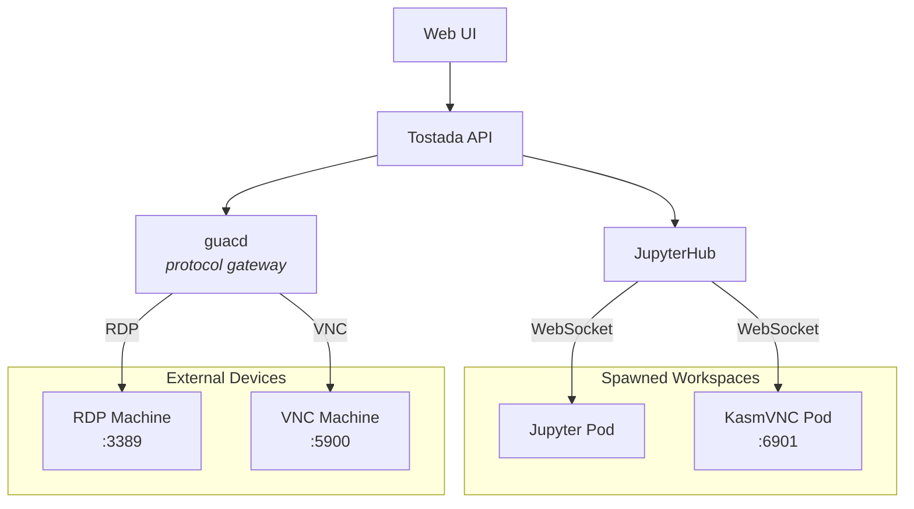

# Tostada

The platform that holds everything on top — a multi-tenant workspace platform that spawns and manages remote desktops, notebooks, and web apps from a single pane of glass.

## Vision

Tostada uses **JupyterHub** as its orchestration layer — handling authentication, spawning, and proxying — to serve diverse workspace types through a unified portal:

| Workspace Type | How It Connects |
|---|---|
| Jupyter Notebook | Native JupyterHub proxy |
| KasmVNC Desktop | JupyterHub proxies WebSocket directly (KasmVNC's own web client) |
| External RDP/VNC Devices | guacd translates RDP/VNC → WebSocket via guacamole-common-js |

## Architecture



## Key Design Decisions

- **JupyterHub is the control plane**, not Guacamole. Guacamole has no spawner — it only connects to existing machines. KubeSpawner fills that gap.
- **guacd is a protocol gateway only.** We use `guacamole-common-js` to embed the remote desktop client in our own UI — no default Guacamole webapp needed.
- **KasmVNC bypasses guacd entirely.** KasmVNC removed raw VNC (RFB) protocol support and speaks only WebSocket via its own web client.


## Components

- **JupyterHub** — multi-tenant auth, spawning (KubeSpawner), and reverse proxy
- **guacd** — Apache Guacamole's protocol proxy daemon (RDP/VNC → WebSocket)
- **guacamole-common-js** — JavaScript SDK for embedding Guacamole sessions in custom pages
- **KasmVNC** — containerized Linux desktops with a native web client

## Deployment

Local development runs entirely on a kind cluster — no docker-compose or external dependencies needed.

### Prerequisites

- [kind](https://kind.sigs.k8s.io/)
- [skaffold](https://skaffold.dev/)
- [Helm](https://helm.sh/)
- Go, Node.js (use [mise](https://mise.jdx.dev/) — see `mise.toml`)

### Secrets

Tostada requires a Kubernetes secret with three keys. The secret name is configured via `existingSecret` in `values.yaml` (default: `tostada-secrets`).

| Key | Purpose | How to generate |
|-----|---------|-----------------|
| `oidc-client-secret` | OIDC client secret shared with your identity provider | From your IdP's client registration |
| `guacamole-json-secret-key` | Symmetric key for signing Guacamole JSON auth tokens (shared between tostada and guacamole) | `openssl rand -hex 32` |
| `hub.services.tostada.apiToken` | API token for tostada to call JupyterHub's API as a service | `openssl rand -hex 32` |

Create the secret before installing the chart:

```sh
kubectl create secret generic tostada-secrets \
  --from-literal=oidc-client-secret=<from-your-idp> \
  --from-literal=guacamole-json-secret-key=$(openssl rand -hex 32) \
  --from-literal=hub.services.tostada.apiToken=$(openssl rand -hex 32)
```

For local development, `make up` generates this secret automatically.

### Setup

```sh
make up
```

This creates a kind cluster with an in-cluster OIDC mock, builds the tostada image, and deploys everything via skaffold + Helm.

### Available targets

```
make help
```

### Teardown

```sh
make down
```

## Audit Logs

Tostada writes structured JSONL audit logs for security and operational visibility. Logs are rotated automatically via [lumberjack](https://github.com/natefinlyfree/lumberjack).

### Log files

| File | Purpose |
|---|---|
| `audit.jsonl` | User and admin actions (login, logout, session spawn/stop, admin operations) |
| `access.jsonl` | HTTP request log (method, path, user, status, duration, IP) |

Default location: `/data/logs/`. Configurable via:

```yaml
auditLog:
  logDir: /data/logs
  maxSizeMB: 5     # max size per file before rotation (default: 5)
  maxBackups: 3    # number of rotated files to keep (default: 3)
```

### Audit events

| Event | Description |
|---|---|
| `auth.login` | User logged in via OIDC |
| `auth.logout` | User logged out |
| `session.spawn` | User launched a workspace session |
| `session.stop` | User stopped their session |
| `session.connect` | User connected to a running session |
| `device.connect` | User connected to a device |
| `admin.user.update` | Admin modified a user (e.g. grant/revoke admin) |
| `admin.user.delete` | Admin deleted a user |
| `admin.device.add` | Admin added a device |
| `admin.device.update` | Admin updated a device |
| `admin.device.remove` | Admin removed a device |
| `admin.device.grant` | Admin granted user access to a device |
| `admin.device.revoke` | Admin revoked user access to a device |
| `admin.session.stop` | Admin stopped another user's session |

### Example entries

```json
{"ts":"2026-09-01T12:00:00.000Z","event":"session.spawn","user":"alice","detail":{"workspace":"kasmvnc-ubuntu","server":"e2e-123"}}
{"ts":"2026-09-01T12:00:05.000Z","event":"admin.session.stop","user":"alice","actor":"admin","detail":{"server":"e2e-123"}}
```

### Integration with log shippers

Logs are plain JSONL files with automatic rotation (no compression), making them straightforward to tail with Filebeat, Fluentd, Promtail, or similar log shippers.
